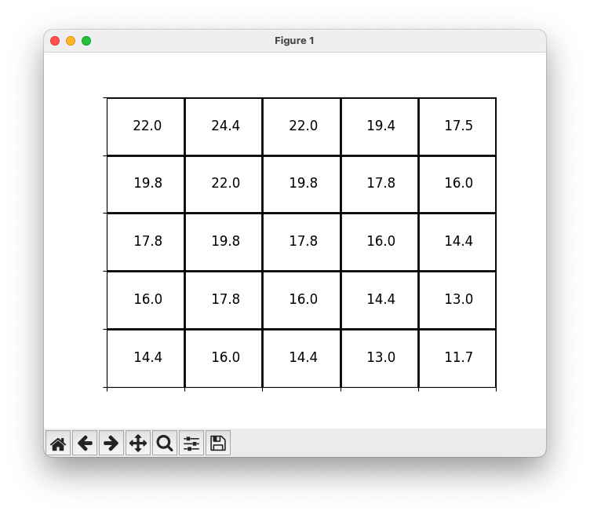

# Markov Decision Process in Python

## Basic Introduction

MDPs is a framing of learning of problem from interaction to achieve the goal. 

*Agent* - The learner and the decision maker. 
*Environment* - That to interact with the agent, comprising everything outside the agent. 

The agent is selecting actions and the environment is responding to the action and presenting new situations to the agent. the environment also gives rise to rewards, special numerical values that the agent seeks to maximize over time through its choice of actions. 
![[Pasted image 20230720102542.png]]

Compared to the bandit problem, which is estimating the value $q_*(a)$ of each action a, the MDPs is estimating the value $q_*(s,a)$ of each action a in each state s. 

*Markov Property* - Memoryless
We assume that the random variable $R_t$ and $S_t$ are following some discrete probability distribution dependent only on the preceding state and action. So, we can define the form p as, 

$$
p(s',r \lvert s,a) \equiv Pr\{S_t = s', R_t=r \lvert S_{t-1}=s, A_{t-1}=a\}
$$

Because the above expression is discrete, we can further express the form as,

$$
\sum_{s' \in \mathcal S} \sum_{r \in \mathcal R} p(s',r \lvert s,a) = 1, \text{for all } s \in \mathcal S, a \in \mathcal A(s)
$$

The probability function p defines the *dynamics* of the MDP. 

*State-transition probabilities*

$$
p(s' \lvert s,a) \equiv Pr \{S_t=s' \lvert S_{t-1}=s, A_{t-1}=a\}
=\sum_{r \in \mathcal R} p(s',r \lvert s,a)
$$

*Expected reward function* - to get the numerical value of expected reward

$$
r(s,a) \equiv \mathbb E [R_t \lvert S_{t-1}=s,A_{t_1}=a] 
=\sum_{r \in \mathcal R} r \sum_{s' \in \mathcal S} p(s',r \lvert s,a)
$$

Intuitively, we can derive the form of the expect rewards for state-action-next-state function, 

$$
r(s,a,s') = \sum_{r \in \mathcal R} r \frac {p(s',r \lvert s,a)}{p(s' \lvert s,a)}
$$

*boundary definition when modeling a problem with MDP*
Simple rule is that anything cannot be changed arbitrarily by the agent is considered to be outside of it and thus part of its environment. 
In a complicated problem, many different agents may be operating at once, each with its own boundary. 

## Goals and Rewards
In reinforcement learning, the goal is formalized as maximizing the expected value of the cumulative sum of a received reward. 

The reward signal is the way of communication to the agent what we want it to achieve, not *how* we want it achieved. Properly setting the rule of gaining reward for agent can prevent the agent to optimize the subgoals without achieving the real goal.

*Sum of sequential rewards after time step t and the discounting*

$$
G_t \equiv R_{t+1} + \gamma R_{t+2} + \gamma^2 R_{t+3}+... = \sum_{k=0}^\infty \gamma^k R_{t+k+1}
$$

where $\gamma$ is a parameter called discount rate, and is least to zero and less than or equal to 1. $G_t$ is called as the return after time step t. 

- myopic - As $\gamma$ is zero, the agent is concerned only with maximizing immediate rewards. 
- farsighted - As $\gamma$ approaches 1, the return objective takes future rewards into strongly account. 

*Recursive form of the return $G_t$*

$$
G_t \equiv R_{t+1} + \gamma G_{t+1}
=\sum_{k=t+1}^\infty \gamma^{k-t-1}R_k
=\sum_{k=0}^\infty \gamma^k R_{t+k+1}
$$

## Polices and Value Functions
*Policy*
A policy $\pi$ is a mapping from states to probabilities of selecting each possible action. 
**Reinforcement learning methods specify how the agent's policy is changed as a result of its experience**

*State-Value function*

$$
v_{\pi}(s) \equiv \mathbb E [G_t \lvert S_t=s]
= \mathbb E_{\pi}[\sum_{k=0}^{\infty} \gamma^k R_{t+k+1} \lvert S_t=s]
$$

*Action-value function*

$$
q_{\pi}(s,a) \equiv \mathbb E_{\pi}[G_t \lvert S_t=s, A_t=a]=
\mathbb E_{\pi}[\sum_{k=0}^{\infty} \gamma^k R_{t+k+1} \lvert S_t=s, A_t=a]
$$

## Bellman Equation
**In reinforce and learning a similar idea allows us to relate the value of the current state to the value of future states without waiting to observe all the future rewards.**

*backup diagram*

![[Pasted image 20230722075950.png]]

For the above backup diagram, it is clear to see that the value of p determines the probability of state transition from s to s' under taking action a. 

*Bellman equation of state-value*

$$
\begin{array}{l}
v_{\pi}(s) \equiv \mathbb E [G_t \lvert S_t=s] \\
=\underset{a}{\sum} \pi(a\lvert s) \underset{s',r}{\sum} p(s',r\lvert s,a) [ r + \gamma v_{\pi}(s')], \text{ for all } s \in \mathcal S
\end{array}
$$

*Bellman Optimality*

$$
v_*(s) = \underset{a}{max} \sum_{s',r} p(s',r \lvert s,a) [r+\gamma v_*(s')]
$$

## Result of Example Gridworld

